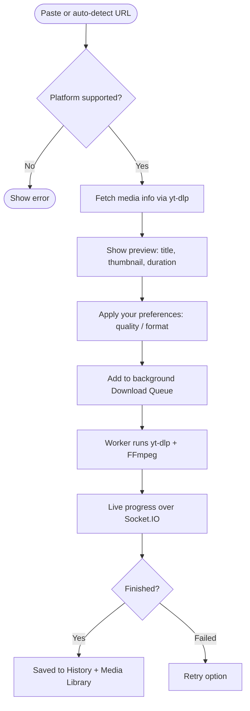
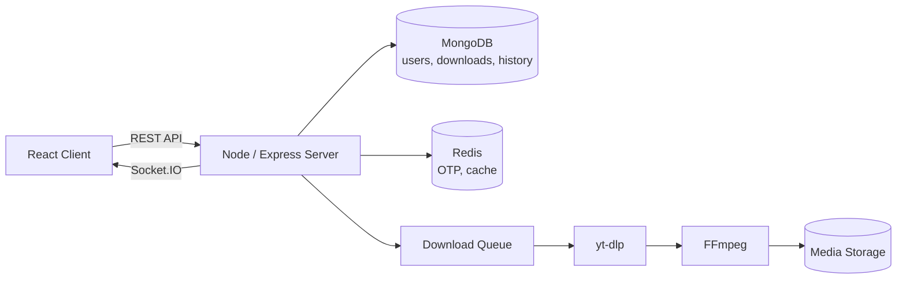
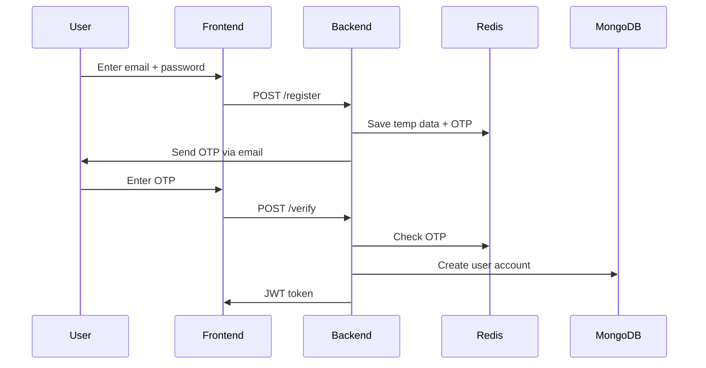

<div align="center">

# 🎬 UniFetch Media

**One app to download and manage media from YouTube, Instagram, and more — no ads, no extra steps.**

[](https://react.dev/)
[](https://nodejs.org/)
[](https://expressjs.com/)
[](https://www.mongodb.com/)
[](https://redis.io/)
[](https://socket.io/)
[](https://vercel.com/)

[🔗 Live Demo](https://unifetch-media.vercel.app/) · [📦 GitHub Repo](https://github.com/MohammadMustafa23/UniFetch-Media)

</div>

---

## 📖 About

Most media downloaders make you jump between different sites, click through ads, and start over for every platform. **UniFetch Media** fixes that with one simple flow:

> Paste a link → preview the media → pick your quality → download runs in the background → track it live → manage everything from your own library.

It's built as a **MERN-stack** app, so the backend does the heavy lifting (via `yt-dlp` + `FFmpeg`) while the frontend stays fast and simple.

---

## ✨ Features

**🔐 Account & Security**
- Email/password signup with OTP email verification
- Google Sign-In (OAuth)
- JWT auth with protected routes
- Forgot / reset password flow
- Rate limiting on sensitive routes

**⬇️ Download Engine**
- Paste a URL, or let auto-detect grab it from your clipboard
- Optional auto-download (skips the manual click)
- Preview before downloading — thumbnail, title, uploader, duration, formats
- Pick quality, format (mp4/mp3), and thumbnail download
- Background download queue — keeps working even if you close the tab
- Live progress (%, speed, ETA) pushed over Socket.IO
- Retry failed downloads, pause/resume active ones

**📚 History & Media Library**
- Every URL you process gets saved to history — even if you don't finish downloading it
- Mark favorites, search and filter
- Stream/play downloaded media right in the browser
- Save to device or share directly (mobile Web Share API)
- Delete files and records anytime

**🔔 Notifications**
- Get notified when a download finishes
- Mark as read, mark all as read, delete, or clear all

**⚙️ Preferences**
- Personal settings for auto-paste, auto-download, default quality/format, and overwrite rules

---

## 🧱 Tech Stack

| Layer             | Technology                                              |
|--------------------|----------------------------------------------------------|
| Frontend           | React, Vite, React Router, Axios, Socket.IO Client       |
| Backend            | Node.js, Express.js, Socket.IO, JWT, bcrypt              |
| Database           | MongoDB (Mongoose)                                       |
| Cache / Temp Data  | Redis (OTPs, user cache)                                  |
| Media Engine       | yt-dlp, FFmpeg, FFprobe, Deno (YouTube extraction)        |
| Auth               | Google OAuth, Nodemailer (OTP emails)                    |
| Hosting            | Vercel (frontend), Render (backend), Upstash (Redis)      |

---

## 🔄 How It Works



---

## 🏗️ Architecture



- **MongoDB** holds permanent data — users, downloads, history, preferences, notifications.
- **Redis** holds short-lived data — OTPs and cached user sessions.
- **Download Queue** keeps the API free while `yt-dlp`/`FFmpeg` do the actual work.
- **Socket.IO** sends progress to a **private room per user**, so nobody sees anyone else's downloads.

<details>
<summary>🔑 Signup / OTP flow (click to expand)</summary>



</details>

---

## 📁 Project Structure

```
UniFetch-Media/
├── client/unifetch-media/     # React frontend
│   └── src/
│       ├── Components/
│       ├── Pages/
│       ├── Services/
│       └── socket/
│
├── server/                    # Node backend
│   ├── bin/                   # ffmpeg, ffprobe, yt-dlp binaries
│   └── src/
│       ├── config/
│       ├── models/
│       ├── routes/
│       ├── controllers/
│       ├── services/
│       └── queue/
│
└── README.md
```

---

## 🔑 Environment Variables

**Server** — create `.env` inside `server/`:
```
PORT=
MONGODB_URI=
REDIS_URL=
JWT_SECRET=
GOOGLE_CLIENT_ID=
GOOGLE_CLIENT_SECRET=
FRONTEND_URL=
EMAIL_USER=
```
*(plus whatever mail/OTP credential your Nodemailer setup needs)*

**Client** — create `.env` inside `client/unifetch-media/`:
```
VITE_BACKEND_URL=
VITE_API_URL=
VITE_GOOGLE_CLIENT_ID=
```

> ⚠️ Never commit `.env` or `youtube_cookies.txt` to GitHub.

---

## 🚀 Getting Started

**Backend**
```bash
git clone https://github.com/MohammadMustafa23/UniFetch-Media.git
cd UniFetch-Media/server
npm install
npm run install-deno
chmod +x bin/ffmpeg bin/ffprobe bin/yt-dlp
npm start
```

**Frontend**
```bash
cd ../client
npm install
npm run dev
```

---

## 🧪 Testing Phase Note

UniFetch is still being polished. Right now, **new accounts are limited to 3 downloads** so people can test the app without overloading the server.

## ⚠️ Known Limitations

- **YouTube** changes its anti-bot system often, so extraction can occasionally break or need updated cookies. Not every video is guaranteed to work.
- **Large downloads** go through the browser to save to device, so speed depends on your network and free storage.

---

## 🗺️ Roadmap

- ☁️ Full cloud storage deployment
- 📦 Per-user storage quota (2 GB planned)
- 🌍 Support for more platforms beyond YouTube & Instagram
- 📊 Deeper download analytics
- ⚙️ More advanced queue infrastructure

---

## ⚖️ Legal Note

UniFetch Media is a **personal project**, built for learning and personal use. It follows YouTube's and Instagram's terms and privacy policies — only download content you have the right to use.

---

## 👤 Author

**Mohammad Mustafa**
Repo: [github.com/MohammadMustafa23/UniFetch-Media](https://github.com/MohammadMustafa23/UniFetch-Media)
